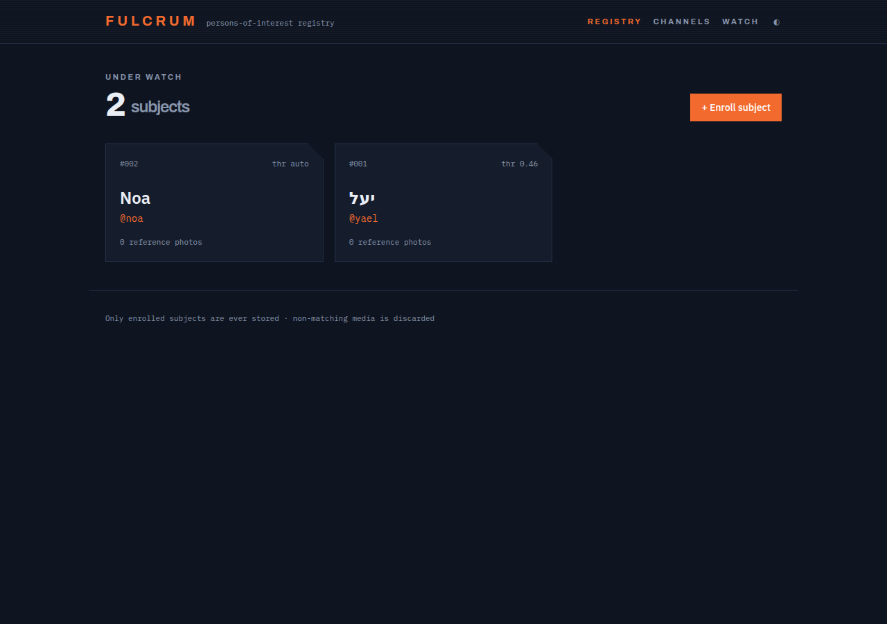
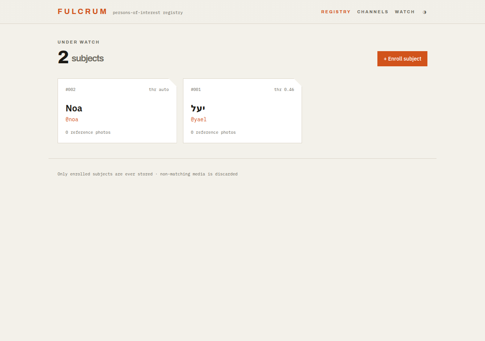
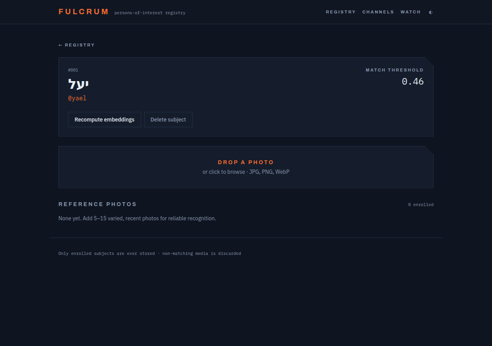
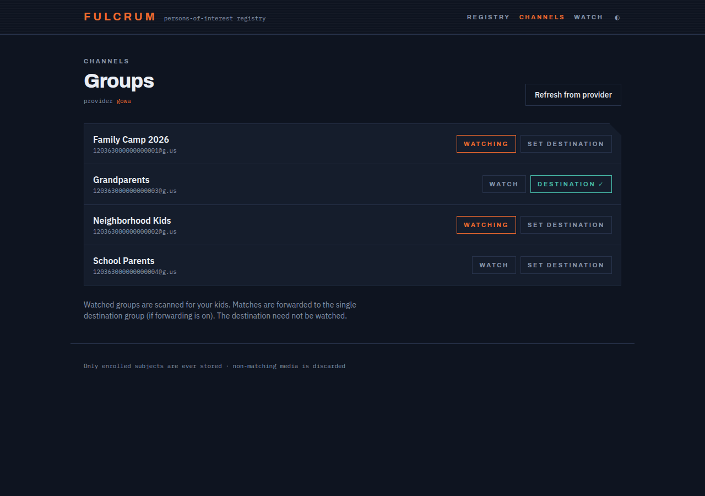
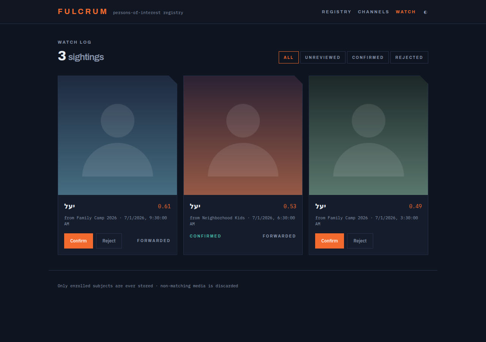

# Fulcrum

**Watch selected WhatsApp groups and get pinged when your kids show up in a shared photo.**

Fulcrum monitors WhatsApp groups you choose, runs each shared image through
self-hosted face recognition, and when one of your enrolled children is
detected it saves the photo and/or forwards it to a group of your choosing.
Photos that don't contain your kids are processed in memory and **discarded** —
never written to disk.

It's built for a home lab: two small services on a private Docker network, no
cloud ML, pure-Go core, and an ARM-friendly footprint.

> The name is a nod to the Rebel intelligence network from *Star Wars*: it
> watches quietly across many channels, identifies persons of interest, and
> routes the intel onward.

---

## Screenshots

### Registry — the people you're watching for


Light mode is system-preference aware, with a toggle in the navbar:



### Enrollment — teach it a child's face
Each child is a dossier: a stable latin *call sign* (used for on-disk folders),
an optional per-child match threshold, and a set of reference photos. Upload is
drag-and-drop; when a photo has several faces you pick the right one.



### Channels — choose what to watch
Toggle which groups are scanned, and pick the single destination group that
matches are forwarded to.



### Watch — review the sightings
Every match, with its similarity score and source group. Confirm a match to
optionally reinforce recognition, or reject it to delete the stored image.



---

## How it works

```
WhatsApp gateway ──webhook──▶  fulcrum (Go)                       ┌─ fulcrum-ml ─┐
    ▲                          ├ intake → durable queue (sqlite)  │  FastAPI +   │
    └──── REST (forward) ──────┤ workers → download → detect ────▶│  insightface │
                               ├ cosine match vs enrolled faces   └──────────────┘
                               ├ sinks: filesystem + WhatsApp forward
                               └ embedded React SPA + REST API + /metrics
```

- **`fulcrum`** (Go) — provider adapter, webhook intake, durable job queue,
  worker pool, matcher, sinks, HTTP API, and the embedded SPA. Ships as a
  `scratch` image.
- **`fulcrum-ml`** (Python/FastAPI) — a thin wrapper around
  [`insightface`](https://github.com/deepinsight/insightface) that does
  detection + 512-d embeddings only. No auth, no storage; it is bound to the
  internal network and never published.

Intake never blocks on ML: the webhook validates, enqueues, and returns; workers
drain the queue. Model weights download to a mounted cache at runtime (they are
not baked into the image).

### Pipeline

1. Gateway delivers a webhook → normalized to an `InboundMessage`.
2. Dropped unless it's an **image** from a **monitored** group.
3. A durable job is enqueued; the webhook returns immediately.
4. A worker downloads the media, dedups by SHA-256, and calls `/detect`.
5. Each detected face is matched (cosine) against enrolled references, using the
   per-subject threshold or the global default.
6. On a match: save to `matches/{slug}/{YYYY}/{MM}/…` and/or forward to the
   destination group. No match → the bytes are discarded.

---

## Quick start (Docker Compose)

```bash
# 1. Point FULCRUM at your WhatsApp gateway and set a webhook secret.
export FULCRUM_PROVIDER_TOKEN=...          # provider credentials
export FULCRUM_SERVER_WEBHOOK_SECRET=...   # verify inbound webhooks

# 2. Bring up both services.
docker compose up -d
```

`fulcrum` is published on `:8080`; `fulcrum-ml` stays on the internal network.
Open <http://localhost:8080>, enroll your kids, connect the provider on the
**Channels** page, and choose which groups to watch.

Configure your gateway to POST inbound events to
`http://<host>:8080/webhook/<provider>` with the header
`X-Webhook-Secret: <your secret>`.

---

## Configuration

Precedence: **flags > environment > YAML file > built-in defaults.** Environment
variables use the `FULCRUM_` prefix with `.` → `_` (e.g. `server.port` →
`FULCRUM_SERVER_PORT`). See [`config.example.yaml`](config.example.yaml).

| Setting | Flag | Env | Default |
|---|---|---|---|
| Config file | `--config` | — | — |
| HTTP port | `--server.port` | `FULCRUM_SERVER_PORT` | `8080` |
| Log level | `--server.log_level` | `FULCRUM_SERVER_LOG_LEVEL` | `info` |
| Webhook secret | — | `FULCRUM_SERVER_WEBHOOK_SECRET` | *(empty = open)* |
| Provider | `--provider.name` | `FULCRUM_PROVIDER_NAME` | `gowa` |
| Provider base URL | — | `FULCRUM_PROVIDER_BASE_URL` | — |
| Provider token | — | `FULCRUM_PROVIDER_TOKEN` | — |
| ML sidecar URL | `--ml.url` | `FULCRUM_ML_URL` | `http://fulcrum-ml:8081` |
| Global threshold | — | `FULCRUM_MATCH_DEFAULT_THRESHOLD` | `0.48` |
| Faces path | — | `FULCRUM_ENROLL_FACES_PATH` | `/data/faces` |
| Workers | `--queue.workers` | `FULCRUM_QUEUE_WORKERS` | `2` |
| Max attempts | — | `FULCRUM_QUEUE_MAX_ATTEMPTS` | `5` |
| Sink mode | — | `FULCRUM_SINK_MODE` | `both` |
| Storage path | — | `FULCRUM_SINK_STORAGE_PATH` | `/data/matches` |
| DB path | — | `FULCRUM_DB_PATH` | `/data/fulcrum.db` |

`--version` prints the build version and exits.

### WhatsApp providers

Pick one; the pipeline is provider-agnostic.

| Provider | `provider.name` | Notes |
|---|---|---|
| [go-whatsapp-web-multidevice](https://github.com/aldinokemal/go-whatsapp-web-multidevice) | `gowa` | **Default.** Native-Go gateway; no third party touches the images. |
| [green-api](https://green-api.com) | `greenapi` | WhatsApp cloud — routes media through a third party; avoid for children's photos. Token is `<idInstance>:<apiToken>`. |
| [wwebjs-api](https://github.com/avoylenko/wwebjs-api) | `wwebjs` | Chromium-backed; heavier on ARM. Drives the `fulcrum` session. |

> Gateway endpoint and webhook field mappings follow each project's own API.
> Confirm them against the version you deploy.

---

## Privacy & security

- **Only enrolled kids are ever stored.** Group images inevitably contain other
  families' children; non-matching media is processed in memory and discarded.
- **`fulcrum-ml` has no auth** and must stay on the internal network — never
  publish it or put it behind a reverse proxy.
- **Set `FULCRUM_SERVER_WEBHOOK_SECRET`.** An open webhook lets anyone enqueue
  provider-supplied media URLs for the worker to fetch. Outbound media fetches
  are additionally guarded against SSRF (loopback/private/link-local addresses
  are refused at dial time; redirects are disabled).
- Rejecting a match deletes its stored file. Secrets are read from env only and
  never logged.

---

## Metrics

Prometheus metrics on `/metrics`: `fulcrum_inbound_messages_total`,
`fulcrum_images_processed_total`, `fulcrum_faces_detected_total`,
`fulcrum_matches_total{subject}`, `fulcrum_embed_latency_seconds`,
`fulcrum_queue_depth`, `fulcrum_job_failures_total`,
`fulcrum_sink_errors_total{sink}`. Liveness on `/healthz`, readiness on
`/readyz`.

---

## Development

```bash
# Backend (embeds the last-built SPA; serves a placeholder until you build it)
./scripts/dev.sh

# Frontend with hot reload (proxies /api to :8080)
cd web && npm ci && npm run dev

# Tests
go test ./...
cd fulcrum-ml && pip install -r requirements-dev.txt && pytest
```

The SPA (React + Vite + TypeScript + Tailwind) lives in `web/` and is embedded
into the Go binary via `go:embed`. Cross-compile release binaries with
`scripts/build.sh`.

---

## Tuning notes

Face-recognition models are adult-biased, so expect lower confidence on young
children, and siblings can resemble each other. Enroll **5–15 varied, recent**
photos per child, tune thresholds against a held-out set of real group photos
(per-subject overrides live in the dossier), and re-enroll periodically as kids
grow. After a model swap, use **Recompute embeddings** to re-embed from the
retained originals — no re-upload needed.

---

## License

Apache-2.0.
