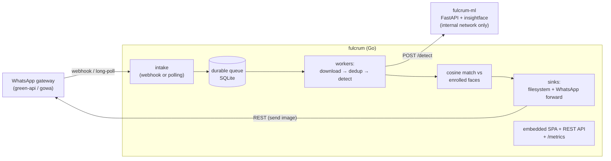

# Fulcrum

[](LICENSE)
[](go.mod)

**Watch selected WhatsApp groups and get pinged when your kids show up in a shared photo.**

Fulcrum monitors WhatsApp groups you choose, runs each shared image through
self-hosted face recognition, and when one of your enrolled children is
detected it saves the photo and/or forwards it to a group of your choosing.
Photos that don't contain your kids are processed in memory and **discarded** —
never saved as image files. (Exception: images a gowa gateway sends inline as
base64 are kept in the job queue inside the SQLite database; see
[Data layout](#data-layout).)

It's built for a home lab: two small services on a private Docker network, no
cloud ML, a pure-Go core, and an ARM-friendly footprint.

> The name is a nod to the Rebel intelligence network from *Star Wars*: it
> watches quietly across many channels, identifies persons of interest, and
> routes the intel onward.

---

## Contents

- [Features](#features)
- [Screenshots](#screenshots)
- [How it works](#how-it-works)
- [Requirements](#requirements)
- [Installation](#installation)
- [Configuration](#configuration)
- [Usage](#usage)
- [API reference](#api-reference)
- [The fulcrum-ml sidecar](#the-fulcrum-ml-sidecar)
- [Privacy & security](#privacy--security)
- [Metrics & health](#metrics--health)
- [Tuning notes](#tuning-notes)
- [Troubleshooting](#troubleshooting)
- [Development](#development)
- [Contributing](#contributing)
- [License](#license)

---

## Features

- **Two WhatsApp providers** — [green-api](https://green-api.com) (cloud,
  messages pulled by long-polling) and
  [go-whatsapp-web-multidevice](https://github.com/aldinokemal/go-whatsapp-web-multidevice)
  (self-hosted, inbound webhook).
- **Self-hosted face recognition** — an `insightface` sidecar (`buffalo_l`:
  SCRFD detector + 512-d ArcFace embeddings) running on CPU; no cloud ML.
- **Per-child enrollment** — named subjects with a stable call sign, reference
  photos (drag-and-drop, `.jpg`/`.jpeg`/`.png`/`.webp`, up to 20 MiB), and a
  face picker when a photo contains several faces.
- **Cosine matching** with a global threshold plus optional per-subject
  overrides; one image can match several kids, each at most once.
- **Durable SQLite job queue** with a worker pool and retries — the webhook
  never waits on ML.
- **Deduplication** by SHA-256 and by perceptual hash (dHash), so re-encoded
  copies of the same photo are skipped.
- **Delivery modes** — `storage-only`, `forward-only`, or `both`; switchable at
  runtime from the Settings page.
- **Active learning** — confirm a sighting to reinforce the subject's
  references (only when the image was stored), or reject it to delete the stored image and record a hard
  negative; a per-subject card suggests a threshold from your reviews.
- **Recompute embeddings** from the retained originals after a model change.
- **Embedded React SPA** with a system-aware dark/light theme and an optional
  login gate.
- **REST API** with Swagger UI at `/api/docs`, **Prometheus metrics** at
  `/metrics`, and `/healthz` / `/readyz` probes.
- **Privacy guards** — non-matching media is never saved as an image file
  (inline gowa media stays in the job queue, see [Data layout](#data-layout)), the webhook can be
  secret-protected, and outbound media fetches are SSRF-guarded.
- **OS service mode** (`--service install|start|…`) via `kardianos/service`.

---

## Screenshots

### Registry — the people you're watching for


Light mode is system-preference aware, with a toggle in the navbar:


### Enrollment — teach it a child's face
Each child is a dossier: a stable Latin *call sign* (used for on-disk folders),
an optional per-child match threshold, and a set of reference photos. Upload is
drag-and-drop; when a photo has several faces, you pick the right one.


### Channels — choose what to watch
Toggle which groups are scanned, and pick the single destination group that
matches are forwarded to.

> **Caveat:** the destination picked here is saved but not yet used by the
> forward sink — forwarding only goes to `sink.destination_group_id`. See
> [Forwarding](#forwarding).


### Watch — review the sightings
Every match, with its similarity score and source group. Confirm a match to
reinforce recognition (only when the image was stored, so never in
`forward-only` mode), or reject it to delete the stored image.


### Settings — tune matching at runtime
Adjust the global threshold and delivery mode without a restart; per-subject
thresholds still win.


---

## How it works


```mermaid
flowchart LR
    GW["WhatsApp gateway<br/>(green-api / gowa)"]
    subgraph core["fulcrum (Go)"]
        IN["intake<br/>(webhook or polling)"]
        Q[("durable queue<br/>SQLite")]
        W["workers:<br/>download → dedup → detect"]
        M["cosine match vs<br/>enrolled faces"]
        S["sinks:<br/>filesystem + WhatsApp forward"]
        UI["embedded SPA + REST API<br/>+ /metrics"]
    end
    ML["fulcrum-ml<br/>FastAPI + insightface<br/>(internal network only)"]

    GW -- "webhook / long-poll" --> IN --> Q --> W
    W -- "POST /detect" --> ML
    W --> M --> S
    S -- "REST (send image)" --> GW
```

- **`fulcrum`** (Go) — provider adapter, intake, durable job queue, worker
  pool, matcher, sinks, HTTP API, and the embedded SPA. Ships as a `scratch`
  image.
- **`fulcrum-ml`** (Python/FastAPI) — a thin wrapper around
  [`insightface`](https://github.com/deepinsight/insightface) that does
  detection + 512-d embeddings only. No auth, no storage; it is bound to the
  internal network and never published.

Intake never blocks on ML: the webhook validates, enqueues, and returns; workers
drain the queue. Model weights download to a mounted cache at runtime (they are
not baked into the image).

### Pipeline

1. The gateway delivers a message (webhook for `gowa`, long-poll for
   `greenapi`) → normalized to an `InboundMessage`.
2. Dropped unless it's an **image** from a **monitored** group.
3. A durable job is enqueued; the webhook returns immediately.
4. A worker downloads the media, dedups by SHA-256 and perceptual hash
   (near-identical re-encodes are skipped), and calls `/detect`.
5. Each detected face is matched (cosine) against enrolled references, using the
   per-subject threshold or the global default.
6. On a match: save to `matches/{slug}/{YYYY}/{MM}/…` and/or forward to the
   destination group with a caption (`name · similarity · from <group> · time`).
   No match → the bytes are discarded.

A job is attempted at most `queue.max_attempts` times in total (the first try
included, so up to `max_attempts − 1` retries) before it is marked dead.

### Data layout

Everything lives under `/data` (the `fulcrum-data` volume):

| Path | Contents |
|---|---|
| `/data/fulcrum.db` | SQLite database: subjects, face embeddings, groups, jobs, matches, settings, dedup hashes. Each job row keeps its media reference; for gowa images sent inline, that is the **whole image as base64**, matched or not, and it is never cleared |
| `/data/faces/{slug}/` | Enrollment reference photos (kept so embeddings can be recomputed) |
| `/data/matches/{slug}/{YYYY}/{MM}/` | Stored matched images |

The `fulcrum-models` volume (`/models` in `fulcrum-ml`) caches the insightface
weights.

---

## Requirements

- **Docker + Docker Compose** (recommended), or Go 1.25.11+ / Node 20 / Python 3.12
  to run from source.
- A **WhatsApp gateway**: a green-api instance, or a self-hosted
  go-whatsapp-web-multidevice.
- **CPU**: `amd64` or `arm64` for `fulcrum-ml` (onnxruntime/insightface are not
  practical on 32-bit ARM). The Go core also builds for `armv6`/`armv7`, `386`,
  macOS, and Windows.
- **Network access on first start** for `fulcrum-ml` to download the
  `buffalo_l` model weights into `/models`.

---

## Installation

> **Note:** no container images or binary releases have been published yet.
> The steps below build everything locally from source.

### Docker Compose (recommended)

```bash
git clone https://github.com/t0mer/fulcrum.git
cd fulcrum
```

The bundled [`docker-compose.yml`](docker-compose.yml) doesn't pass provider
credentials into the container, so add them with a
`docker-compose.override.yml` (Compose merges it automatically; keep it out of
git):

```yaml
services:
  fulcrum:
    environment:
      FULCRUM_PROVIDER_NAME: greenapi                  # or gowa
      FULCRUM_PROVIDER_TOKEN: ${FULCRUM_PROVIDER_TOKEN}
      # FULCRUM_PROVIDER_BASE_URL: https://7103.api.greenapi.com  # cluster URL / gowa URL
      FULCRUM_SERVER_WEBHOOK_SECRET: ${FULCRUM_SERVER_WEBHOOK_SECRET}
      FULCRUM_SERVER_AUTH_TOKEN: ${FULCRUM_SERVER_AUTH_TOKEN}
      # FULCRUM_SINK_DESTINATION_GROUP_ID: 1203630000000000@g.us  # see "Forwarding"
```

Then build and start both services:

```bash
export FULCRUM_PROVIDER_TOKEN=...          # green-api: <idInstance>:<apiToken>
export FULCRUM_SERVER_WEBHOOK_SECRET=...   # protects /webhook/* (set it for green-api too)
export FULCRUM_SERVER_AUTH_TOKEN=...       # optional: protects the UI/API
docker compose up -d --build
```

`fulcrum` is published on `:8080`; `fulcrum-ml` stays on the internal network.
Open <http://localhost:8080>, enroll your kids on the **Registry** page, and
choose which groups to watch on the **Channels** page.

The first start of `fulcrum-ml` downloads the model weights; its `/readyz`
returns `503` (and `/detect` refuses work) until the model has loaded.

### Build from source

```bash
# 1. Build the SPA (embedded into the Go binary).
cd web && npm ci && npm run build && cd ..

# 2a. Build for the current platform…
go build -o fulcrum ./cmd/fulcrum

# 2b. …or cross-compile all release targets into dist/
VERSION=dev ./scripts/build.sh
```

`scripts/build.sh` produces `fulcrum_<os>_<arch>` binaries for linux
(`amd64`, `arm64`, `armv7`, `armv6`, `386`), darwin (`amd64`, `arm64`), and
windows (`amd64`, `arm64`).

The Go binary still needs a running `fulcrum-ml`; see
[running the sidecar without Docker](#running-without-docker).

### OS service

```bash
sudo ./fulcrum --service install --config /etc/fulcrum/config.yaml
sudo ./fulcrum --service start
./fulcrum --service status     # running | stopped | unknown
```

Actions: `install`, `uninstall`, `start`, `stop`, `restart`, `status`. The
installed service re-runs with the same flags you passed alongside `--service`.
Environment variables are **not** captured, so put settings in the YAML file or
flags when running as a service.

---

## Configuration

Precedence: **flags > environment > YAML file > built-in defaults.** Environment
variables use the `FULCRUM_` prefix with `.` → `_` (e.g. `server.port` →
`FULCRUM_SERVER_PORT`). Pass a YAML file with `--config`; see
[`config.example.yaml`](config.example.yaml). Supply secrets via environment
variables rather than the file.

| YAML key | Flag | Env | Default | Description |
|---|---|---|---|---|
| — | `--config` | `FULCRUM_CONFIG` | — | Path to a YAML config file |
| `server.port` | `--server.port` | `FULCRUM_SERVER_PORT` | `8080` | HTTP listen port |
| `server.log_level` | `--server.log_level` | `FULCRUM_SERVER_LOG_LEVEL` | `info` | `debug` \| `info` \| `warning` \| `error` |
| `server.webhook_secret` | — | `FULCRUM_SERVER_WEBHOOK_SECRET` | *(empty = open)* | Required value of the `X-Webhook-Secret` header on `/webhook/*` |
| `server.auth_token` | — | `FULCRUM_SERVER_AUTH_TOKEN` | *(empty = open)* | Protects `/api` (`X-API-Token` header or Basic Auth password) |
| `provider.name` | `--provider.name` | `FULCRUM_PROVIDER_NAME` | `greenapi` | `greenapi` \| `gowa` |
| `provider.base_url` | — | `FULCRUM_PROVIDER_BASE_URL` | *(empty)* | green-api cluster URL (defaults to `https://api.green-api.com`); gowa gateway URL (required for gowa) |
| `provider.token` | — | `FULCRUM_PROVIDER_TOKEN` | *(empty)* | green-api: `<idInstance>:<apiToken>`; gowa: `user:password` (Basic Auth) or a bearer token |
| `ml.url` | `--ml.url` | `FULCRUM_ML_URL` | `http://fulcrum-ml:8081` | Base URL of the `fulcrum-ml` sidecar |
| `ml.det_score` | — | `FULCRUM_ML_DET_SCORE` | `0.5` | Accepted but not currently sent to the sidecar; set `FULCRUM_ML_DET_SCORE` on `fulcrum-ml` instead |
| `match.default_threshold` | — | `FULCRUM_MATCH_DEFAULT_THRESHOLD` | `0.48` | Global cosine threshold, must be in (0, 1); overridable at runtime and per subject |
| `match.near_dup_distance` | — | `FULCRUM_MATCH_NEAR_DUP_DISTANCE` | `4` | Max dHash distance to treat two images as the same; `0` disables |
| `enroll.faces_path` | — | `FULCRUM_ENROLL_FACES_PATH` | `/data/faces` | Reference photos, `{faces_path}/{slug}/` |
| `queue.workers` | `--queue.workers` | `FULCRUM_QUEUE_WORKERS` | `2` | Worker goroutines (keep low on ARM CPUs) |
| `queue.max_attempts` | — | `FULCRUM_QUEUE_MAX_ATTEMPTS` | `5` | Total attempts (including the first) before a job is marked dead |
| `sink.mode` | — | `FULCRUM_SINK_MODE` | `both` | `storage-only` \| `forward-only` \| `both` (the Settings page overrides it) |
| `sink.storage_path` | — | `FULCRUM_SINK_STORAGE_PATH` | `/data/matches` | Root of stored matches |
| `sink.destination_group_id` | — | `FULCRUM_SINK_DESTINATION_GROUP_ID` | *(empty)* | Provider group ID (e.g. `…@g.us`) that matches are forwarded to; empty = no forwarding |
| `db_path` | — | `FULCRUM_DB_PATH` | `/data/fulcrum.db` | SQLite database file |

Other flags: `--version` prints the build version and exits;
`--service <action>` controls the OS service (see [OS service](#os-service)).

### Runtime settings

The **Settings** page (and `PUT /api/settings`) stores a global threshold and
delivery mode in the database. They apply to new sightings immediately and take
precedence over `match.default_threshold` / `sink.mode`. A subject's own
threshold always wins over both.

### WhatsApp providers

Pick one; the pipeline is provider-agnostic.

| Provider | `provider.name` | Notes |
|---|---|---|
| [green-api](https://green-api.com) | `greenapi` | **Default.** WhatsApp cloud; messages are pulled via the bot library (no inbound webhook needed). Token is `<idInstance>:<apiToken>`. Set `provider.base_url` to your cluster URL if the console shows one. Note: media is routed through a third party. |
| [go-whatsapp-web-multidevice](https://github.com/aldinokemal/go-whatsapp-web-multidevice) | `gowa` | Native-Go gateway; no third party touches the images. Requires `provider.base_url`. |

> Gateway endpoints and webhook field mappings follow each project's own API.
> Confirm them against the version you deploy.

**green-api intake (polling, not webhook).** Fulcrum receives green-api messages
with the [`whatsapp-chatbot-golang`](https://github.com/green-api/whatsapp-chatbot-golang)
bot library, which long-polls `ReceiveNotification`/`DeleteNotification`. In the
green-api console the instance must have **incoming notifications enabled** and
**no outgoing webhook URL set** — green-api delivers to the pull queue *or*
pushes to a webhook, not both. Notifications queued while Fulcrum is down are
preserved and processed on restart (the queue is not flushed on startup), so a
long outage may produce a short backlog burst. The `/webhook/greenapi` route
is still mounted and still parses green-api payloads, so **set
`FULCRUM_SERVER_WEBHOOK_SECRET` for green-api too** — otherwise that route is
open and anyone can submit download URLs for the worker to fetch.

**gowa intake (webhook).** Configure the gateway to POST inbound events to
`http://<host>:8080/webhook/gowa` with the header
`X-Webhook-Secret: <your secret>`. Only group messages (`…@g.us`) with an image
are considered. Images may arrive inline (base64) or as a URL that Fulcrum
fetches.

### Forwarding

Forwarded matches go to the group in `sink.destination_group_id`
(`FULCRUM_SINK_DESTINATION_GROUP_ID`), read at startup. The group IDs are shown
under each group name on the **Channels** page. The destination you mark on the
Channels page is saved in the database, but the forward sink currently reads
only this setting, so set both and restart after changing it.
<!-- TODO: verify — UI destination selection is not wired into the forward sink -->

---

## Usage

1. **Registry** — create a subject with a display name and a call sign
   (`^[a-z0-9-]{1,32}$`, used for folder names), then open its dossier.
2. **Dossier** — drag-and-drop 5–15 reference photos. If a photo contains
   several faces, pick the right one. Optionally set a per-subject threshold,
   apply a suggested threshold from the tuning card, or **Recompute
   embeddings**.
3. **Channels** — the group list is refreshed from the provider on load
   (**Refresh from provider** re-fetches it). Toggle **Watch** on the groups to
   scan and mark a destination.
4. **Watch** — review sightings. **Confirm** marks the match and adds the
   matched face to the subject's references — but only if the image was stored,
   so in `forward-only` mode confirming never reinforces; **Reject** deletes the
   stored image and records a hard negative for threshold tuning.
5. **Settings** — change the global threshold and delivery mode at runtime.

---

## API reference

Interactive API docs (Swagger UI) are served at **`/api/docs`**, with the raw
OpenAPI spec at `/api/openapi.yaml` (source:
[`internal/api/openapi.yaml`](internal/api/openapi.yaml)).

When `server.auth_token` is set, every `/api` route except `/api/authinfo`
requires `X-API-Token: <token>` or HTTP Basic Auth with the token as the
password.

| Method | Path | Purpose |
|---|---|---|
| `GET` | `/api/authinfo` | Public; `{"auth_required": bool}` |
| `GET` / `POST` | `/api/subjects` | List / create subjects (`name`, `slug`, optional `threshold`) |
| `POST` | `/api/subjects/reembed` | Recompute embeddings for all subjects |
| `GET` / `PATCH` / `DELETE` | `/api/subjects/{id}` | Get / update (`name`, `threshold`, `clear_threshold`) / delete a subject, its faces, and its stored matches |
| `POST` | `/api/subjects/{id}/faces` | Upload a reference photo (multipart `file`, optional `face_index`); returns `300` with candidates when several faces are found |
| `GET` | `/api/subjects/{id}/faces/{faceID}/image` | Reference photo |
| `DELETE` | `/api/subjects/{id}/faces/{faceID}` | Remove a reference photo |
| `POST` | `/api/subjects/{id}/reembed` | Recompute one subject's embeddings |
| `GET` | `/api/subjects/{id}/tuning` | Review stats and a suggested threshold |
| `GET` | `/api/groups` | Refresh from the provider and list groups |
| `PATCH` | `/api/groups/{id}` | Set `monitored` and/or `is_destination` |
| `GET` | `/api/matches` | List matches (`?reviewed=`, `?subject_id=`) |
| `GET` | `/api/matches/{id}/image` | Stored match image |
| `POST` | `/api/matches/{id}/review` | `{"decision": "confirm"\|"reject", "reinforce": bool}` |
| `GET` | `/api/provider` | Active provider name |
| `POST` | `/api/provider/test` | Connectivity check (lists groups) |
| `GET` / `PUT` | `/api/settings` | Effective `global_threshold`, `sink_mode`, `provider` |
| `POST` | `/webhook/{provider}` | Inbound gateway webhook (outside `/api`; uses `X-Webhook-Secret`) |

---

## The fulcrum-ml sidecar

`fulcrum-ml/` is a FastAPI service around `insightface`. Fulcrum calls it for
both enrollment and matching.

| Method | Path | Purpose |
|---|---|---|
| `POST` | `/detect` | Multipart `file=<image>` → `{"faces": [{"bbox", "det_score", "embedding"}]}` (L2-normalized 512-d) |
| `GET` | `/healthz` | `200` while the process is up |
| `GET` | `/readyz` | `200` once the model has loaded, `503` before |
| `GET` | `/api/docs` | Swagger UI |

Environment variables (prefix `FULCRUM_ML_`):

| Env | Default | Description |
|---|---|---|
| `FULCRUM_ML_MODEL_NAME` | `buffalo_l` | insightface model pack |
| `FULCRUM_ML_MODEL_ROOT` | `/models` | Weight cache directory (mount as a volume) |
| `FULCRUM_ML_DET_SIZE` | `640` | Square detection input size; larger is more accurate but slower |
| `FULCRUM_ML_DET_SCORE` | `0.5` | Minimum detection score to keep a face (don't go below 0.5) |
| `FULCRUM_ML_CTX_ID` | `-1` | onnxruntime device: `-1` = CPU, `>= 0` = GPU device ID |
| `FULCRUM_ML_LOG_LEVEL` | `INFO` | Log level |

The container listens on `8081` and runs as a non-root user (UID 10001). The
image is built for `linux/amd64` and `linux/arm64`.

### Running without Docker

```bash
cd fulcrum-ml
python3.12 -m venv .venv && . .venv/bin/activate
pip install -r requirements.txt
FULCRUM_ML_MODEL_ROOT=./models uvicorn app.main:app --host 127.0.0.1 --port 8081
```

Then point Fulcrum at it with `FULCRUM_ML_URL=http://127.0.0.1:8081`.

---

## Privacy & security

- **Only enrolled kids are ever stored.** Group images inevitably contain other
  families' children; non-matching media is processed in memory and discarded.
  The exception is gowa images sent inline as base64: the job queue keeps them
  in `/data/fulcrum.db`, matched or not, and nothing clears them.
- **`fulcrum-ml` has no auth** and must stay on the internal network — never
  publish it or put it behind a reverse proxy.
- **Always set `FULCRUM_SERVER_WEBHOOK_SECRET`**, even with green-api:
  `/webhook/{provider}` is always mounted for the active provider. An open
  webhook lets anyone enqueue provider-supplied media URLs for the worker to
  fetch. The secret is only accepted in the header, never the query string.
  Outbound media fetches are additionally guarded against SSRF
  (loopback/private/link-local addresses are refused at dial time; redirects are
  disabled), and the provider's credentials are only sent to the provider's own
  host.
- **Optional API auth.** Set `FULCRUM_SERVER_AUTH_TOKEN` to gate the whole
  `/api` surface behind a token — presented as `X-API-Token` or HTTP Basic Auth
  (the token as the password). The UI then shows a login screen; leave it empty
  for open bootstrap on a trusted network. `/metrics`, `/healthz`, `/readyz`,
  and the static SPA are not gated.
- Rejecting a match deletes its stored file; deleting a subject removes its
  reference photos and stored matches. Keep secrets in environment variables,
  not the YAML file.
- With **green-api**, media passes through green-api's cloud; use **gowa** if no
  third party should see the images.

### Login (when an auth token is set)


---

## Metrics & health

Prometheus metrics on `/metrics`:

| Metric | Type | Labels |
|---|---|---|
| `fulcrum_inbound_messages_total` | counter | `provider`, `group` |
| `fulcrum_images_processed_total` | counter | — |
| `fulcrum_faces_detected_total` | counter | — |
| `fulcrum_matches_total` | counter | `subject` |
| `fulcrum_embed_latency_seconds` | histogram | — (not yet wired; always empty) |
| `fulcrum_queue_depth` | gauge | — |
| `fulcrum_job_failures_total` | counter | — (not yet wired; always 0) |
| `fulcrum_sink_errors_total` | counter | `sink` (`fs`, `whatsapp`) |

Go runtime metrics are exported too. Liveness is on `/healthz` (returns the
version) and readiness on `/readyz` (checks the database).

---

## Tuning notes

Face-recognition models are adult-biased, so expect lower confidence on young
children, and siblings can resemble each other. Enroll **5–15 varied, recent**
photos per child and re-enroll periodically as kids grow. After a model swap,
use **Recompute embeddings** to re-embed from the retained originals — no
re-upload needed.

As you **confirm** and **reject** sightings, each subject's dossier shows a
**threshold-tuning** card: the lowest similarity you accepted, the highest you
rejected, and a suggested threshold sitting in the gap — one click to apply it
as that child's per-subject override.

---

## Troubleshooting

- **No groups on the Channels page** — check the provider token/base URL;
  **Refresh from provider** (`POST /api/provider/test`) reports the gateway
  error.
- **green-api messages never arrive** — make sure incoming notifications are
  enabled and no outgoing webhook URL is set in the green-api console.
- **gowa webhook returns 401** — the `X-Webhook-Secret` header doesn't match
  `FULCRUM_SERVER_WEBHOOK_SECRET`. A **404** means the path provider
  (`/webhook/<name>`) isn't the active `provider.name`.
- **`refusing to connect to a non-public address`** — the media URL points to a
  private or loopback address (for example a gowa gateway on your LAN), which
  the SSRF guard blocks. Configure the gateway to send images inline (base64) in
  the webhook. Be aware that inline images are then kept in the job queue in
  `/data/fulcrum.db`, matched or not, and nothing clears them.
- **Enrollment fails or no faces are detected right after startup** —
  `fulcrum-ml` is still downloading/loading the model; wait for its `/readyz`.
- **Matches are found but not forwarded** — set
  `FULCRUM_SINK_DESTINATION_GROUP_ID` and check that the delivery mode isn't
  `storage-only` (see [Forwarding](#forwarding)).
- **Startup error `must be greenapi|gowa`, `storage-only|forward-only|both`, or
  `must be in (0,1)`** — invalid `provider.name`, `sink.mode`, or
  `match.default_threshold`.

---

## Development

```bash
# Backend: go run with a local ./.dev-data dir (embeds the last-built SPA;
# serves a placeholder until you build it). Point it at a local sidecar.
FULCRUM_ML_URL=http://127.0.0.1:8081 ./scripts/dev.sh

# Frontend with hot reload (proxies /api, /healthz, /readyz, /metrics to :8080)
cd web && npm ci && npm run dev

# Tests
go test ./...
cd fulcrum-ml && pip install -r requirements-dev.txt && pytest
```

The SPA (React + Vite + TypeScript + Tailwind) lives in `web/` and is embedded
into the Go binary via `go:embed`. Cross-compile release binaries with
`scripts/build.sh`.

### Project layout

```
cmd/fulcrum/        entry point, flags, service mode
internal/api/       REST handlers, auth, webhook, OpenAPI spec
internal/config/    Viper config loading
internal/enroll/    reference-photo enrollment and re-embedding
internal/intake/    shared admission path (webhook + polling)
internal/match/     cosine matcher and threshold suggestions
internal/ml/        fulcrum-ml HTTP client
internal/phash/     perceptual hash (dHash)
internal/pipeline/  per-image processing
internal/queue/     durable worker pool
internal/sink/      filesystem and WhatsApp forward sinks
internal/store/     SQLite store and migrations
internal/whatsapp/  green-api and gowa adapters
web/                React SPA (embedded)
fulcrum-ml/         Python ML sidecar
scripts/            build.sh, dev.sh, next-version.sh
```

### CI workflows

`.github/workflows/` contains manually triggered **Release** (cross-compiled
binaries + GitHub Release), **Docker** (multi-arch images to Docker Hub), and
**Publish to GHCR** workflows. Versions follow `YYYY.M.PATCH`.

---

## Contributing

Issues and pull requests are welcome. Please run `go test ./...`, the web build
(`npm run build`), and the sidecar tests (`pytest`) before opening a PR.

---

## License

[Apache License 2.0](LICENSE).
